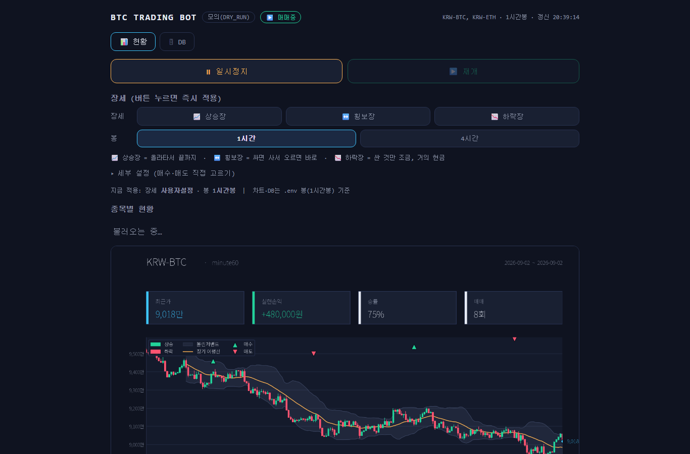
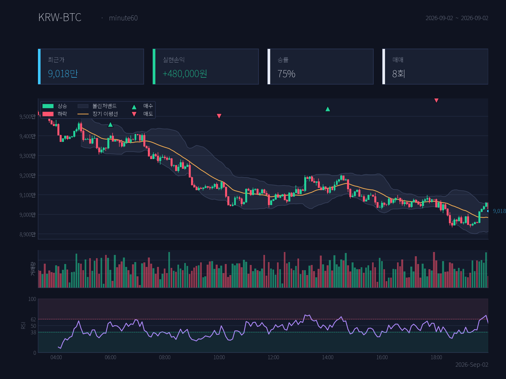

# 실시간 암호화폐 데이터 파이프라인 + 자동매매 봇


## 스크린샷

> 아래 그림은 **가짜(랜덤 생성) 시세 데이터**로 로컬에서 띄운 화면입니다.



*웹 대시보드 — 현황·수익률·차트, 일시정지/재개, 장세 프리셋 (DRY_RUN 모의 모드)*



*자동 생성 리포트 — 캔들 + 볼린저밴드 + 장기 이평선 + 매수/매도 마커*

업비트 시세를 **수집 → 저장 → 가공 → 품질검사 → 분석/시각화**하는 데이터 파이프라인과,
그 데이터를 활용해 규칙대로 매매하고 텔레그램·웹 대시보드로 보고하는 자동매매 봇.

별도 인프라(DB 서버·Airflow 등) 없이 **Python + SQLite**만으로 단일 노드에서 동작하도록 구성했다.

> ⚠️ **면책 조항 — 꼭 읽기**
> - **이 프로젝트는 투자 조언이 아니며, 학습·실험용이다.** 기본 전략은 예시일 뿐 수익을 보장하지 않고,
>   실거래로 인한 손실은 전적으로 사용자 본인의 책임이다.
> - 실거래 전 반드시 `DRY_RUN=true`(모의매매)로 충분히 검증할 것.
> - 업비트 API 키는 **출금 권한 없이** 발급하고, `.env`에만 보관한다(`.gitignore`로 커밋 제외).
> - 이 프로젝트의 핵심은 *매매 수익*이 아니라 **데이터 파이프라인 설계·운영**이다.

---

## 주요 기능

- **데이터 파이프라인**: 업비트 캔들 수집(UPSERT 멱등 적재) → 지표 계산(이평선·RSI·볼린저·일목) → 데이터 품질검사(빠진 봉·결측치·신선도) → 실패 시 텔레그램 알림
- **자동매매 봇**: 지표 기반 매수/매도 규칙, 멀티코인(`TICKERS`), 추세 필터·트레일링 스탑, 손절/익절, 모의매매(DRY_RUN)
- **백테스트**: 과거 데이터로 전략 성적 검증 (`backtest.py`)
- **텔레그램 봇**: 상태/통계 조회, 차트 버튼, 일시정지·재개·종료 명령
- **웹 대시보드**: 현황·캔들차트·DB 표(시세/지표/매매기록) 조회, 일시정지/재개 — 기본 인증(관리자/읽기 전용 계정 분리)
- **운영**: systemd 서비스로 24시간 실행, GitHub Actions CI(컴파일·임포트 검사)

## 아키텍처

```
   ┌─────────── 데이터 파이프라인 (pipeline.py) ──────────┐
   │                                                      │
업비트 API ──▶ [수집] ──▶ raw_candles ──▶ [가공] ──▶ indicators
 (ingest.py)              (원본 시세)    (transform.py)   (지표)
                                                  │
                                            [품질검사]
                                           (quality.py) ──▶ dq_checks
                                                  │
                          ┌───────────────────────┴───────────────────────┐
                          ▼                                                ▼
                   매매봇 (bot.py)                                 분석/시각화
                   - 지표로 매수/매도 판단                          - report.py: 요약 + 차트(PNG)
                   - 텔레그램 알림                                  - dashboard.py: 웹 대시보드
                   - 매매기록 → trades 테이블
                          │
                   ┌──────┴──────┐
              데이터 창고 (SQLite, db.py): raw_candles / indicators / trades / dq_checks
```

- **수집(ingest)**: 거래소에서 캔들을 받아 원본 그대로 저장 (UPSERT → 중복 없음 = 멱등성)
- **가공(transform)**: 원본으로 지표(이평선·RSI·볼린저·일목) 계산해 저장
- **품질검사(quality)**: 빠진 봉·결측치·신선도 점검 → 문제 시 텔레그램 알림
- **오케스트레이션(pipeline)**: 위 단계를 순서대로(DAG) 주기 실행 + 실패 처리·로깅
- **서빙(report/dashboard)**: 창고 데이터로 요약·차트·웹 화면 제공
- **소비자(bot)**: 데이터를 활용해 매매, 결과를 다시 창고에 적재

## 파일 구성

| 파일 | 역할 |
|------|------|
| `db.py` | 데이터 창고(SQLite) — 테이블 생성·적재·조회 |
| `ingest.py` | [수집] 업비트 → raw_candles |
| `transform.py` | [가공] raw_candles → indicators (지표 계산) |
| `quality.py` | [품질검사] 빠진 봉·결측치·신선도 점검 |
| `pipeline.py` | [오케스트레이터] 수집→가공→품질 순서 실행 |
| `report.py` | [분석/시각화] 요약 + 차트(report.png) |
| `dashboard.py` | 웹 대시보드 (Flask + waitress, 기본 인증) |
| `strategy.py` | 지표 계산 + 매수/매도 규칙 (가공·봇이 공용) |
| `trader.py` | 주문 실행 / 모의매매 / 통계 / 매매기록 적재 |
| `bot.py` | 매매봇 (전략 신호로 매매 + 텔레그램) |
| `notifier.py` | 텔레그램 알림 + 명령 |
| `backtest.py` | 과거 데이터로 전략 검증 |
| `config.py` | `.env` 설정 로더 |
| `.env.example` | 설정 템플릿 (복사해서 `.env`) |
| `*.service` | systemd 유닛 (pipeline / trading-bot / dashboard) |

## 데이터 창고 스키마

| 테이블 | 내용 | 키 |
|--------|------|-----|
| `raw_candles` | 원본 시세(시가·고가·저가·종가·거래량) | (market, timeframe, candle_time) |
| `indicators` | 계산된 지표 | (market, timeframe, candle_time) |
| `trades` | 매매 기록(side·price·krw·pnl·mode) | id |
| `dq_checks` | 품질검사 결과 | id |

---

## 설치 (우분투 기준)

```bash
sudo apt update && sudo apt install -y python3 python3-pip python3-venv git fonts-nanum
cd ~/btc-trading-bot
python3 -m venv venv
source venv/bin/activate
pip install -r requirements.txt
```
> `fonts-nanum` 은 리포트 차트(`report.py`)의 한글 라벨용. 없어도 영어 라벨로 정상 생성된다.

## 설정

```bash
cp .env.example .env
nano .env     # 텔레그램 토큰/chat id, (실거래 시) 업비트 키, 거래 설정 입력
```
- 텔레그램 봇: `@BotFather` 로 토큰, `@userinfobot` 으로 chat id. **봇한테 메시지 한 번 먼저 보낼 것.**
- 처음엔 `DRY_RUN=true` 유지. 전략 파라미터·매수/매도 방식(`BUY_MODE`/`SELL_MODE`)도 `.env`에서 조정.
- 대시보드를 쓰려면 `.env`에 `DASH_USER`/`DASH_PASS`(관리자), 선택으로 `DASH_VIEW_USER`/`DASH_VIEW_PASS`(읽기 전용)를 추가.

## 실행 순서

**1) 데이터 파이프라인 (먼저 켠다 — 창고를 채워야 함)**
```bash
python pipeline.py     # 수집→가공→품질을 주기적으로 반복
```

**2) 단계별로 따로 돌려보고 싶을 때**
```bash
python ingest.py       # 수집만
python transform.py    # 가공만
python quality.py      # 품질검사만
```

**3) 리포트 / 대시보드**
```bash
python report.py       # 콘솔 요약 + report.png 생성
python dashboard.py    # 웹 대시보드 (기본 인증 필수)
```

**4) 매매봇 (모의매매부터)**
```bash
python backtest.py     # 전략 과거 성적 확인
python bot.py          # 매매 시작 (DRY_RUN=true 면 연습)
```

## 24시간 자동 실행 (systemd)

경로/User 수정 후 서비스로 등록:
```bash
sudo cp pipeline.service trading-bot.service dashboard.service /etc/systemd/system/
sudo systemctl daemon-reload
sudo systemctl enable --now pipeline trading-bot dashboard
journalctl -u pipeline -f      # 로그 실시간 확인
```

## 텔레그램 명령

- `/status` `/stats` — 매매 횟수·실현손익·수익률·승률·보유상태
- `/report` + 📊 차트 버튼 — 차트 이미지 받기
- `/pause` `/resume` — 매매 일시정지/재개
- `/stop` — 봇 종료

---

## 기술적 특징

- **멱등 적재**: 캔들 UPSERT로 재실행해도 중복 없음 — 파이프라인 재시작·백필에 안전
- **관심사 분리**: 수집/가공/품질/서빙/매매를 파일 단위로 분리, 전략은 `strategy.py`의 `generate_signal()` 하나만 고치면 됨
- **상태 지속성**: `state.json`·`market.db`에 상태 저장 → 재시작해도 이어서 동작
- **안전장치**: DRY_RUN 모의매매, 손절/익절/트레일링 스탑, 대시보드 기본 인증(관리자/읽기 전용 역할 분리), 비밀값은 `.env`로만 관리
- **CI**: `.github/workflows/ci.yml` — 푸시마다 전체 컴파일 + 전 모듈 임포트 스모크 테스트 (API 키 불필요, 실거래 없음)

가볍게 직접 구현했지만 각 부분은 실무 데이터 엔지니어링 도구와 대응된다.

| 이 프로젝트 | 실무 대응 | 개념 |
|---|---|---|
| SQLite (`db.py`) | PostgreSQL + TimescaleDB | 시계열 데이터 창고 |
| `pipeline.py` 루프 | Airflow / Dagster / Prefect | 오케스트레이션(DAG·스케줄·재시도) |
| `transform.py` | dbt | staging → mart 변환 |
| `quality.py` | Great Expectations / dbt tests | 데이터 품질 검증 |
| UPSERT | idempotent write | 멱등성 |
| `report.py` / `dashboard.py` | Grafana / Metabase | 서빙·BI |

## 라이선스

MIT License (`LICENSE` 참고)
